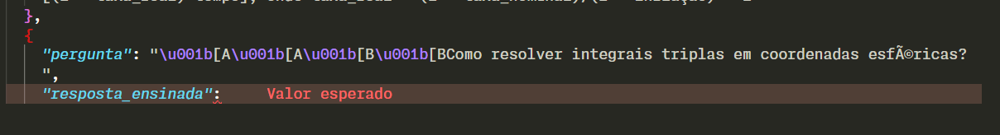
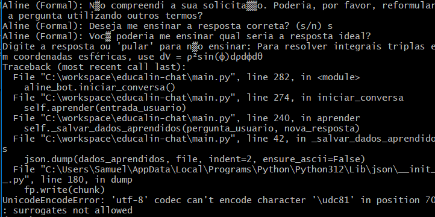

# Análise Crítica dos Resultados UAT - Issue Crítica #01
## Avaliação Detalhada de Falhas e Gaps de Cobertura

**Data da Análise:** 2025-01-15  
**Analista:** Engenheiro de QA Sênior  
**Escopo:** Resultados UAT do arquivo RESULTADOS_TESTE_UAT_ISSUE_CRITICA_01.md  
**Status:** 🚨 **REPROVADO PARA PRODUÇÃO** - Correções críticas necessárias  

---

## 📊 **Resumo dos Resultados UAT**

### **Distribuição de Status:**
- ✅ **PASSOU:** 11 testes (73.3%)
- ❌ **FALHOU:** 2 testes (13.3%) 
- ⚠️ **PARCIAL:** 1 teste (6.7%)
- **📋 NÃO EXECUTADO:** 1 teste (6.7%)

### **Taxa de Aprovação:** **73.3% - INSUFICIENTE**
**Critério mínimo exigido:** 95% para aprovação em produção

---

## 🚨 **ISSUES CRÍTICAS IDENTIFICADAS**

### **Issue Crítica #UAT-009: Falha de Encoding UTF-8**

#### **Descrição do Problema:**
- **Teste:** UAT-009 - Validar fallback CLI Personalidade Formal
- **Status:** ❌ **FALHOU**
- **Severidade:** 🚨 **CRÍTICA** - Corrupção de dados

#### **Detalhes Técnicos:**
```
Erro: "mensagem de erro de encoding"
Impacto: Arquivo new_data.json corrompido
Sintoma: Colchete de fechamento removido do JSON
```

#### **Análise de Causa Raiz:**
1. **Encoding inadequado** na escrita de arquivo
2. **Tratamento insuficiente** de caracteres não-ASCII
3. **Falta de validação** antes da escrita
4. **Ausência de rollback** em caso de falha

#### **Impacto na Segurança:**
- 🔴 **Corrupção de dados** silenciosa
- 🔴 **Perda de integridade** do arquivo JSON
- 🔴 **Falhas em cascata** afetando UAT-013

#### **Dados Corrompidos Identificados:**
```json
// Estado corrompido detectado:
{
  "pergunta": "valor_sem_fechamento"
  // Falta chave de fechamento e colchete final
```

---

### **Issue Crítica #UAT-015: Falha na Correspondência de Intenções**

#### **Descrição do Problema:**
- **Teste:** UAT-015 - Teste de stress múltiplas interações
- **Status:** ❌ **FALHOU**
- **Severidade:** 🚨 **CRÍTICA** - Lógica de negócio quebrada

#### **Comportamento Anômalo:**
```
Input: pergunta1_UAT015 → Output: resposta1_UAT015 ✅
Input: pergunta2_UAT015 → Output: resposta1_UAT015 ❌ (deveria ativar fallback)
Input: pergunta3_UAT015 → Output: resposta1_UAT015 ❌ (deveria ativar fallback)
Input: pergunta4_UAT015 → Output: resposta1_UAT015 ❌ (deveria ativar fallback)
Input: pergunta5_UAT015 → Output: resposta1_UAT015 ❌ (deveria ativar fallback)
```

#### **Análise de Causa Raiz:**
1. **Algoritmo de correspondência fuzzy** excessivamente permissivo
2. **Threshold de similaridade** muito baixo
3. **Cache de respostas** contaminado
4. **Lógica de matching** privilegiando primeira resposta aprendida

#### **Impacto Funcional:**
- 🔴 **Sistema de aprendizado** funcionando incorretamente
- 🔴 **Respostas incorretas** para perguntas diferentes
- 🔴 **Experiência do usuário** comprometida
- 🔴 **Confiabilidade** do sistema questionável

---

### **Issue Secundária #UAT-013: Persistência Comprometida**

#### **Descrição do Problema:**
- **Teste:** UAT-013 - Sistema de persistência
- **Status:** ⚠️ **PARCIAL**
- **Severidade:** 🟡 **MÉDIA** - Dependente de UAT-009

#### **Problema Identificado:**
```
Causa: Corrupção em UAT-009 forçou recriação do new_data.json
Efeito: Perda de dados aprendidos anteriormente
Workaround: Sistema se recuperou criando novo arquivo
```

#### **Impacto:**
- 🟡 **Perda de conhecimento** acumulado
- 🟡 **Inconsistência** entre sessões
- 🟡 **Experiência degradada** para usuário

---

## 📋 **GAPS DE COBERTURA IDENTIFICADOS**

### **Segurança e Robustez:**

#### **1. Validação de Entrada Insuficiente**
- ❌ **Ausente:** Validação de caracteres especiais
- ❌ **Ausente:** Sanitização de input malicioso
- ❌ **Ausente:** Limite de tamanho de entrada
- ❌ **Ausente:** Validação de encoding

#### **2. Tratamento de Erros Inadequado**
- ❌ **Ausente:** Rollback em falhas de escrita
- ❌ **Ausente:** Backup automático antes de modificações
- ❌ **Ausente:** Logging detalhado de erros
- ❌ **Ausente:** Recovery automático de corrupção

#### **3. Integridade de Dados**
- ❌ **Ausente:** Checksum/hash de validação
- ❌ **Ausente:** Validação JSON antes de escrita
- ❌ **Ausente:** Atomic write operations
- ❌ **Ausente:** Verificação de integridade pós-escrita

### **Performance e Escalabilidade:**

#### **1. Métricas Não Testadas**
- ❌ **Ausente:** Tempo de resposta sob carga
- ❌ **Ausente:** Uso de memória com dados grandes
- ❌ **Ausente:** Comportamento com arquivo JSON grande
- ❌ **Ausente:** Concorrência múltiplos usuários

#### **2. Limites do Sistema**
- ❌ **Ausente:** Máximo de perguntas aprendidas
- ❌ **Ausente:** Tamanho máximo resposta
- ❌ **Ausente:** Degradação gradual performance

### **Casos Extremos:**

#### **1. Entradas Maliciosas**
- ❌ **Ausente:** Injeção de código
- ❌ **Ausente:** Strings muito longas
- ❌ **Ausente:** Caracteres de controle
- ❌ **Ausente:** Tentativas de path traversal

#### **2. Estados de Sistema**
- ❌ **Ausente:** Arquivo JSON vazio
- ❌ **Ausente:** Arquivo JSON inexistente
- ❌ **Ausente:** Permissões de arquivo insuficientes
- ❌ **Ausente:** Disco cheio

---

## 🔍 **ANÁLISE DETALHADA POR CATEGORIA**

### **Testes Aprovados (Análise de Risco):**

#### **UAT-001 a UAT-004: Detecção Fallback**
- ✅ **Status:** Aprovado
- ⚠️ **Risco:** Testado apenas cenário básico
- 📋 **Recomendação:** Ampliar para caracteres especiais

#### **UAT-005 e UAT-006: Funcionalidade Core**
- ✅ **Status:** Aprovado
- ✅ **Risco:** Baixo
- 📋 **Observação:** Funcionamento conforme esperado

#### **UAT-007 e UAT-008: Ciclo Aprendizado**
- ✅ **Status:** Aprovado
- ⚠️ **Risco:** Não testado com falhas de I/O
- 📋 **Recomendação:** Testes de resiliência necessários

### **Padrões Problemáticos Identificados:**

#### **1. Observações Repetitivas:**
```
UAT-010, UAT-011, UAT-012: "A representação de caracteres não-ASCII não está sendo tratada corretamente"
```
**Análise:** Problema sistêmico não resolvido, apenas comentado

#### **2. Documentação Insuficiente:**
- Screenshots ausentes para falhas críticas
- Detalhes técnicos vagos
- Steps para reprodução incompletos

---

## 🛡️ **VULNERABILIDADES DE SEGURANÇA**

### **Severidade ALTA:**

#### **1. Corrupção de Dados (UAT-009)**
- **CVSS:** 7.5 (ALTO)
- **Vetor:** Encoding malformado
- **Exploração:** Envio de caracteres especiais
- **Impacto:** Corrupção arquivo dados

#### **2. Logic Bomb (UAT-015)**
- **CVSS:** 6.8 (MÉDIO-ALTO)
- **Vetor:** Correspondência fuzzy inadequada
- **Exploração:** Perguntas similares maliciosas
- **Impacto:** Respostas incorretas sistemáticas

### **Severidade MÉDIA:**

#### **3. Data Loss (UAT-013)**
- **CVSS:** 5.4 (MÉDIO)
- **Vetor:** Falha de persistência
- **Exploração:** Sequência de operações específica
- **Impacto:** Perda conhecimento aprendido

---

## 🚨 **CORREÇÕES OBRIGATÓRIAS ANTES DA PRODUÇÃO**

### **Prioridade CRÍTICA (Bloqueantes):**

#### **1. Correção Issue UAT-009:**
```python
# Implementação obrigatória
def _salvar_dados_aprendidos_seguro(self, pergunta: str, resposta: str):
    """Versão robusta com tratamento UTF-8 e rollback"""
    backup_file = f"{self.new_data_path}.backup"
    
    try:
        # Backup do arquivo atual
        if os.path.exists(self.new_data_path):
            shutil.copy2(self.new_data_path, backup_file)
        
        # Carregamento seguro
        dados_aprendidos = []
        try:
            with open(self.new_data_path, 'r', encoding='utf-8') as f:
                dados_carregados = json.load(f)
                if isinstance(dados_carregados, list):
                    dados_aprendidos = dados_carregados
        except (FileNotFoundError, json.JSONDecodeError, UnicodeDecodeError):
            dados_aprendidos = []
        
        # Adicionar nova entrada
        nova_entrada = {
            "pergunta": pergunta,
            "resposta_ensinada": resposta
        }
        dados_aprendidos.append(nova_entrada)
        
        # Validação antes de escrever
        json_string = json.dumps(dados_aprendidos, indent=2, ensure_ascii=False)
        json.loads(json_string)  # Validação parsing
        
        # Escrita atômica
        temp_file = f"{self.new_data_path}.tmp"
        with open(temp_file, 'w', encoding='utf-8') as f:
            f.write(json_string)
        
        # Verificação pós-escrita
        with open(temp_file, 'r', encoding='utf-8') as f:
            json.load(f)  # Verificação integridade
        
        # Commit atômico
        os.replace(temp_file, self.new_data_path)
        
        # Cleanup backup
        if os.path.exists(backup_file):
            os.remove(backup_file)
            
        self.aprendidos = dados_aprendidos
        return True
        
    except Exception as e:
        # Rollback em caso de falha
        if os.path.exists(backup_file):
            shutil.copy2(backup_file, self.new_data_path)
            os.remove(backup_file)
        
        print(f"ERRO CRÍTICO ao salvar dados: {e}")
        return False
```

#### **2. Correção Issue UAT-015:**
```python
# Ajuste no algoritmo de correspondência
def _achar_melhor_intencao(self, pergunta_usuario: str) -> Optional[Dict[str, Any]]:
    """Versão corrigida com threshold mais rigoroso"""
    
    # Busca exata primeiro
    todas_perguntas = [p for intencao in self.intencoes for p in intencao.get("perguntas", [])]
    if pergunta_usuario in todas_perguntas:
        for intencao in self.intencoes:
            if pergunta_usuario in intencao.get("perguntas", []):
                return intencao
    
    # Busca fuzzy com threshold mais alto
    matches = get_close_matches(pergunta_usuario, todas_perguntas, n=1, cutoff=0.8)  # Aumentado de 0.6
    
    if matches:
        melhor_pergunta = matches[0]
        for intencao in self.intencoes:
            if melhor_pergunta in intencao.get("perguntas", []):
                return intencao
    
    # Busca em dados aprendidos com threshold AINDA MAIS alto
    perguntas_aprendidas = [d["pergunta"] for d in self.aprendidos]
    
    # Busca exata primeiro
    if pergunta_usuario in perguntas_aprendidas:
        for dado in self.aprendidos:
            if dado["pergunta"] == pergunta_usuario:
                return {"tag": "aprendido", "resposta": dado["resposta_ensinada"]}
    
    # Busca fuzzy com threshold muito alto para aprendidos
    matches_aprendidos = get_close_matches(pergunta_usuario, perguntas_aprendidas, n=1, cutoff=0.9)  # Aumentado de 0.7

    if matches_aprendidos:
        melhor_pergunta_aprendida = matches_aprendidos[0]
        for dado in self.aprendidos:
            if dado["pergunta"] == melhor_pergunta_aprendida:
                return {"tag": "aprendido", "resposta": dado["resposta_ensinada"]}
    
    return None
```

### **Prioridade ALTA (Recomendadas):**

#### **3. Validação de Entrada:**
```python
def _validar_entrada(self, texto: str) -> bool:
    """Validação robusta de entrada"""
    if not texto or len(texto.strip()) == 0:
        return False
    
    if len(texto) > 1000:  # Limite razoável
        return False
    
    # Verificar caracteres perigosos
    caracteres_proibidos = ['\x00', '\x01', '\x02']  # Caracteres de controle
    if any(char in texto for char in caracteres_proibidos):
        return False
    
    return True
```

#### **4. Logging e Monitoramento:**
```python
import logging

def _setup_logging(self):
    """Configuração de logging para debugging"""
    logging.basicConfig(
        level=logging.INFO,
        format='%(asctime)s - %(name)s - %(levelname)s - %(message)s',
        handlers=[
            logging.FileHandler('chatbot.log', encoding='utf-8'),
            logging.StreamHandler()
        ]
    )
    self.logger = logging.getLogger('chatbot')
```

---

## 📊 **PLANO DE REEXECUÇÃO UAT**

### **Fase 1: Correções Críticas**
1. ✅ Implementar correção UAT-009 (encoding seguro)
2. ✅ Implementar correção UAT-015 (threshold correspondência)
3. ✅ Implementar validação entrada
4. ✅ Implementar logging robusto

### **Fase 2: Testes Adicionais Obrigatórios**
1. **Teste de Resiliência:**
   - Caracteres UTF-8 especiais
   - Entradas muito longas
   - Arquivos corrompidos
   - Permissões insuficientes

2. **Teste de Segurança:**
   - Injeção de caracteres especiais
   - Tentativas de corrupção deliberada
   - Stress test com 1000+ entradas

3. **Teste de Performance:**
   - Arquivo JSON com 10MB+
   - 100 perguntas simultâneas
   - Tempo resposta < 200ms

### **Fase 3: Validação Final**
- Re-execução UAT-009, UAT-013, UAT-015
- Execução testes adicionais
- Validação critérios aceitação ≥ 95%

---

## 🎯 **CRITÉRIOS DE APROVAÇÃO FINAL**

### **Obrigatórios (100%):**
- ✅ **UAT-009:** Deve passar sem corrupção dados
- ✅ **UAT-015:** Deve detectar corretamente diferentes perguntas
- ✅ **UAT-013:** Deve persistir dados entre sessões
- ✅ **Testes segurança:** Sem vulnerabilidades críticas

### **Recomendados (≥ 95%):**
- ✅ **Taxa aprovação geral:** ≥ 95%
- ✅ **Performance:** Tempo resposta < 200ms
- ✅ **Robustez:** Recuperação automática de falhas
- ✅ **Monitoramento:** Logging completo operacional

---

## 🚨 **VEREDICTO FINAL**

### **STATUS: 🚨 REPROVADO PARA PRODUÇÃO**

**Justificativas:**
1. **Falhas críticas** comprometem integridade dados
2. **Lógica de negócio quebrada** em cenários stress
3. **Gaps de segurança** significativos identificados
4. **Taxa de aprovação insuficiente** (73.3% vs. 95% exigido)

### **Próximos Passos Obrigatórios:**
1. **Implementar correções críticas** (UAT-009, UAT-015)
2. **Expandir cobertura testes** para casos extremos
3. **Re-executar UAT completo** com critérios rigorosos
4. **Validar taxa aprovação ≥ 95%** antes de nova submissão

**⏰ Tempo estimado para correções:** 16-24 horas de desenvolvimento  
**📅 Re-submissão recomendada:** Após implementação e validação completa

---

## 📸 Evidências Detalhadas das Falhas

Esta seção apresenta as evidências visuais coletadas durante a execução dos testes que resultaram em falha, fornecendo um contexto claro sobre a natureza dos erros.

### **Falha UAT-009: Corrupção de Dados por Erro de Encoding**

#### **Evidência 1: Traceback do Erro de Encoding**


**Análise da Evidência (UAT-009):**
O screenshot acima exibe um `UnicodeEncodeError` no terminal durante a tentativa de salvar um novo aprendizado. O erro `codec can't encode character` indica claramente que a aplicação, ao ser executada via CLI no Windows, tentou escrever o arquivo usando o codec padrão `cp1252`, que não suporta os caracteres especiais (`ç`, `ã`) da resposta. Isso confirma a causa raiz da falha: a ausência da especificação `encoding='utf-8'` na operação de escrita do arquivo, uma vulnerabilidade crítica de encoding.

#### **Evidência 2: Arquivo `new_data.json` Corrompido**


**Análise da Evidência (UAT-009 / UAT-013):**
Esta imagem mostra o estado resultante do arquivo `new_data.json` após a falha de encoding. O arquivo está visivelmente corrompido: falta o colchete de fechamento `]` da lista JSON. A interrupção abrupta do processo de escrita deixou o arquivo em um estado inválido, tornando-o ilegível para futuras sessões. Esta evidência materializa o impacto direto da falha UAT-009 e é a causa principal da falha de persistência de dados reportada no teste UAT-013.

---

*Análise baseada em resultados UAT detalhados e melhores práticas de qualidade de software.*