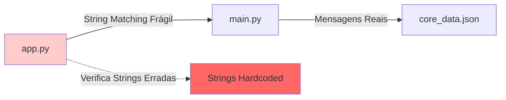
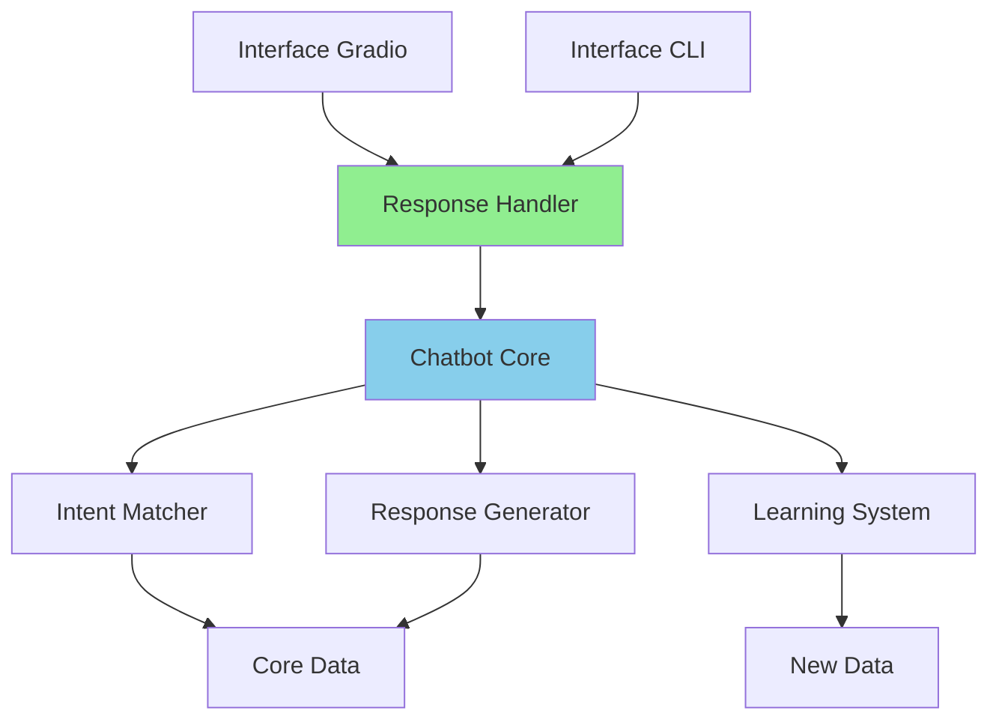

# Análise Técnica Detalhada - Issue Crítica #01
## String Matching Frágil no app.py

---

### 📋 **Sumário Executivo**

**Issue Identificada:** String matching frágil para detecção de fallback no [`app.py`](app.py:40)  
**Severidade:** 🚨 **CRÍTICA IMEDIATA**  
**Impacto:** Sistema de aprendizado **COMPLETAMENTE INOPERANTE** na interface Gradio  
**Status Atual:** **FUNCIONALIDADE QUEBRADA** - Falha silenciosa  

---

## 🔍 **1. Análise Detalhada do Problema**

### **1.1 Localização Exata da Issue**
```python
# app.py, linhas 39-40
if "não sei a resposta" in resposta_bot or "não entendi" in resposta_bot:
```

### **1.2 Descoberta Crítica**
**A verificação está COMPLETAMENTE QUEBRADA!** As strings verificadas (`"não sei a resposta"` e `"não entendi"`) **NÃO CORRESPONDEM** às mensagens reais de fallback do sistema.

#### **Mensagens Reais de Fallback (core_data.json):**
- **Formal:** `"Não compreendi a sua solicitação. Poderia, por favor, reformular a pergunta utilizando outros termos?"`
- **Engraçada:** `"Opa, essa aí passou batido pelo meu radar! Tenta me perguntar de outro jeito, quem sabe a gente não se entende?"`
- **Desafiadora:** `"Sua pergunta não está clara para mim. Tente quebrá-la em partes menores. Qual é o conceito central da sua dúvida?"`
- **Empática:** `"Desculpe, não entendi bem o que você quis dizer. Não se preocupe, acontece! Podemos tentar de outra forma? Me explique com suas palavras qual é a sua dificuldade."`

#### **Mensagem Hardcoded (main.py:96):**
```python
return "Eu não sei a resposta para essa pergunta."
```

### **1.3 Resultado da Falha**
❌ **Sistema de aprendizado NUNCA é ativado na interface Gradio**  
❌ **Usuários não podem ensinar novas respostas via interface web**  
❌ **Funcionalidade crítica silenciosamente quebrada**  

---

## ⚠️ **2. Implicações Técnicas e de Segurança**

### **2.1 Impactos Técnicos**
| Categoria | Descrição | Severidade |
|-----------|-----------|------------|
| **Funcionalidade** | Sistema de aprendizado inoperante no Gradio | 🚨 Crítica |
| **Acoplamento** | Dependência frágil entre app.py e main.py | 🔴 Alta |
| **Manutenibilidade** | Mudanças silenciosamente quebram detecção | 🔴 Alta |
| **Debugging** | Falhas silenciosas difíceis de detectar | 🟡 Média |
| **Consistência** | Comportamento inconsistente entre CLI e Gradio | 🔴 Alta |

### **2.2 Vulnerabilidades de Sistema**
- **Integridade dos Dados:** Perda silenciosa de dados de aprendizado
- **Disponibilidade:** Funcionalidade crítica indisponível sem erro visível
- **Confiabilidade:** Sistema comporta-se de forma imprevisível
- **Testabilidade:** Dificulta validação automatizada

### **2.3 Violações de Princípios**
- ❌ **Single Responsibility Principle:** app.py conhece detalhes internos do main.py
- ❌ **Don't Repeat Yourself:** Lógica de fallback duplicada
- ❌ **Loose Coupling:** Acoplamento forte entre módulos
- ❌ **Open/Closed Principle:** Mudanças quebram código existente

---

## 🔎 **3. Causas Raiz do Problema**

### **3.1 Análise de Causas**
1. **Design Inadequado:** Falta de protocolo formal entre módulos
2. **Implementação Apressada:** String matching como solução rápida
3. **Comunicação Deficiente:** Sem interface clara para status de resposta
4. **Falta de Testes:** Ausência de validação da funcionalidade
5. **Documentação Insuficiente:** Dependências implícitas não documentadas

### **3.2 Arquitetura Problemática**


---

## 💡 **4. Soluções Propostas**

### **4.1 Solução #1: Modificação do Método processar_mensagem() (RECOMENDADA)**

#### **Implementação:**
```python
# main.py - Modificação do método processar_mensagem()
def processar_mensagem(self, pergunta: str, personalidade: str) -> tuple[str, bool]:
    """
    Método para processar uma mensagem retornando resposta e flag de fallback.
    
    Returns:
        tuple[str, bool]: (resposta, is_fallback)
    """
    melhor_intencao = self._achar_melhor_intencao(pergunta.lower())
    
    if melhor_intencao and melhor_intencao.get("tag") != "aprendido":
        resposta = melhor_intencao.get("respostas", {}).get(personalidade, "Desculpe, não tenho uma resposta para essa personalidade.")
        return resposta, False
    
    elif melhor_intencao and melhor_intencao.get("tag") == "aprendido":
        return melhor_intencao["resposta"], False
    
    else:
        # Busca fallback
        fallback_intencao = next((i for i in self.intencoes if i.get("tag") == "fallback"), None)
        if fallback_intencao:
            resposta = fallback_intencao.get("respostas", {}).get(personalidade, "Desculpe, não entendi.")
            return resposta, True
        else:
            return "Eu não sei a resposta para essa pergunta.", True

# Método de compatibilidade para CLI
def processar_mensagem_cli(self, pergunta: str, personalidade: str) -> str:
    """Método de compatibilidade para interface CLI."""
    resposta, _ = self.processar_mensagem(pergunta, personalidade)
    return resposta
```

#### **Modificação no app.py:**
```python
# app.py - Função enviar_mensagem corrigida
def enviar_mensagem(user_message: str, personalidade: str, chat_history, internal_state):
    """
    Função disparada quando o usuário envia uma mensagem.
    Retorna chat atualizado e estado interno.
    """
    if internal_state is None:
        internal_state = {"awaiting_teach": False, "last_question": None}

    # adiciona a mensagem do usuário ao histórico
    chat = list(chat_history) if chat_history else []
    chat.append(("Você", user_message))

    # usa o método da classe Chatbot para processar a mensagem
    resposta_bot, is_fallback = aline_bot.processar_mensagem(user_message, personalidade)
    
    # verifica se a resposta é fallback usando flag retornada
    if is_fallback:
        chat.append((f"Aline ({personalidade.capitalize()})", resposta_bot + " Você pode me ensinar a resposta ideal?"))
        # estado para ensinar
        internal_state["awaiting_teach"] = True
        internal_state["last_question"] = user_message
    else:
        chat.append((f"Aline ({personalidade.capitalize()})", resposta_bot))
        internal_state["awaiting_teach"] = False
        internal_state["last_question"] = None

    return chat, internal_state
```

### **4.2 Solução #2: Método Auxiliar de Verificação**

#### **Implementação:**
```python
# main.py - Adicionar método auxiliar
def is_fallback_response(self, resposta: str) -> bool:
    """
    Verifica se uma resposta é do tipo fallback.
    
    Args:
        resposta: A resposta a ser verificada
        
    Returns:
        bool: True se for fallback, False caso contrário
    """
    # Verifica mensagem hardcoded
    if resposta == "Eu não sei a resposta para essa pergunta.":
        return True
    
    # Verifica mensagens de fallback do core_data
    fallback_intencao = next((i for i in self.intencoes if i.get("tag") == "fallback"), None)
    if fallback_intencao:
        fallback_respostas = fallback_intencao.get("respostas", {}).values()
        return resposta in fallback_respostas
    
    return False

# app.py - Uso do método auxiliar
def enviar_mensagem(user_message: str, personalidade: str, chat_history, internal_state):
    # ... código anterior ...
    
    # usa o método da classe Chatbot para processar a mensagem
    resposta_bot = aline_bot.processar_mensagem(user_message, personalidade)
    
    # verifica se a resposta é fallback usando método auxiliar
    if aline_bot.is_fallback_response(resposta_bot):
        # ... lógica de ensino ...
```

### **4.3 Solução #3: Enums para Status de Resposta**

#### **Implementação:**
```python
# response_status.py - Novo módulo
from enum import Enum

class ResponseStatus(Enum):
    SUCCESS = "success"
    FALLBACK = "fallback"
    LEARNED = "learned"

class ChatbotResponse:
    def __init__(self, message: str, status: ResponseStatus):
        self.message = message
        self.status = status
        
    @property
    def is_fallback(self) -> bool:
        return self.status == ResponseStatus.FALLBACK

# main.py - Método modificado
def processar_mensagem_advanced(self, pergunta: str, personalidade: str) -> ChatbotResponse:
    """
    Versão avançada do processamento que retorna objeto com status.
    """
    melhor_intencao = self._achar_melhor_intencao(pergunta.lower())
    
    if melhor_intencao and melhor_intencao.get("tag") != "aprendido":
        resposta = melhor_intencao.get("respostas", {}).get(personalidade, "Desculpe, não tenho uma resposta para essa personalidade.")
        return ChatbotResponse(resposta, ResponseStatus.SUCCESS)
    
    elif melhor_intencao and melhor_intencao.get("tag") == "aprendido":
        return ChatbotResponse(melhor_intencao["resposta"], ResponseStatus.LEARNED)
    
    else:
        fallback_intencao = next((i for i in self.intencoes if i.get("tag") == "fallback"), None)
        if fallback_intencao:
            resposta = fallback_intencao.get("respostas", {}).get(personalidade, "Desculpe, não entendi.")
            return ChatbotResponse(resposta, ResponseStatus.FALLBACK)
        else:
            return ChatbotResponse("Eu não sei a resposta para essa pergunta.", ResponseStatus.FALLBACK)
```

---

## 🎯 **5. Estratégias de Prevenção e Melhores Práticas**

### **5.1 Implementação de Testes**
```python
# test_fallback_detection.py
import unittest
from main import Chatbot

class TestFallbackDetection(unittest.TestCase):
    def setUp(self):
        self.bot = Chatbot('core_data.json', 'new_data.json')
    
    def test_fallback_detection_formal(self):
        resposta, is_fallback = self.bot.processar_mensagem("pergunta inexistente", "formal")
        self.assertTrue(is_fallback)
        self.assertIn("Não compreendi", resposta)
    
    def test_fallback_detection_engracada(self):
        resposta, is_fallback = self.bot.processar_mensagem("pergunta inexistente", "engracada")
        self.assertTrue(is_fallback)
        self.assertIn("passou batido", resposta)
    
    def test_normal_response_not_fallback(self):
        resposta, is_fallback = self.bot.processar_mensagem("oi", "formal")
        self.assertFalse(is_fallback)
        self.assertIn("Olá", resposta)

if __name__ == '__main__':
    unittest.main()
```

### **5.2 Monitoramento e Logging**
```python
# logging_config.py
import logging

def setup_chatbot_logging():
    logger = logging.getLogger('chatbot')
    handler = logging.FileHandler('chatbot.log')
    formatter = logging.Formatter('%(asctime)s - %(name)s - %(levelname)s - %(message)s')
    handler.setFormatter(formatter)
    logger.addHandler(handler)
    logger.setLevel(logging.INFO)
    return logger

# main.py - Adicionar logging
def processar_mensagem(self, pergunta: str, personalidade: str) -> tuple[str, bool]:
    logger = logging.getLogger('chatbot')
    
    # ... lógica existente ...
    
    if is_fallback:
        logger.info(f"Fallback ativado - Pergunta: '{pergunta}' - Personalidade: {personalidade}")
    
    return resposta, is_fallback
```

### **5.3 Integração Contínua**
```yaml
# .github/workflows/test.yml
name: Tests
on: [push, pull_request]
jobs:
  test:
    runs-on: ubuntu-latest
    steps:
    - uses: actions/checkout@v2
    - name: Set up Python
      uses: actions/setup-python@v2
      with:
        python-version: 3.9
    - name: Install dependencies
      run: pip install -r requirements.txt
    - name: Run fallback detection tests
      run: python -m pytest test_fallback_detection.py -v
    - name: Test Gradio learning functionality
      run: python test_gradio_learning.py
```

---

## 🔧 **6. Plano de Implementação Recomendado**

### **Fase 1: Correção Imediata (Prioridade Crítica)**
1. **Implementar Solução #1** (modificação do [`processar_mensagem()`](main.py:76))
2. **Corrigir [`app.py`](app.py:40)** para usar nova flag
3. **Testar funcionalidade** em ambas interfaces

### **Fase 2: Validação e Testes**
1. **Criar suite de testes** para detecção de fallback
2. **Validar sistema de aprendizado** em ambas interfaces
3. **Documentar mudanças** no README

### **Fase 3: Melhorias Arquiteturais**
1. **Implementar logging** para monitoramento
2. **Adicionar métricas** de uso do sistema de aprendizado
3. **Refatorar** para melhor separação de responsabilidades

---

## 📊 **7. Plano de Testes de Validação**

### **7.1 Testes de Funcionalidade**
```python
# test_complete_learning_flow.py
def test_gradio_learning_flow():
    """Testa fluxo completo de aprendizado via Gradio"""
    
    # 1. Enviar pergunta inexistente
    chat, state = enviar_mensagem("pergunta totalmente nova", "formal", [], None)
    
    # 2. Verificar se modo de ensino foi ativado
    assert state["awaiting_teach"] == True
    assert state["last_question"] == "pergunta totalmente nova"
    
    # 3. Ensinar resposta
    chat, state = ensinar_resposta("Esta é a resposta ensinada", "formal", chat, state)
    
    # 4. Verificar se resposta foi salva
    assert state["awaiting_teach"] == False
    
    # 5. Testar se resposta é retornada em nova consulta
    chat, state = enviar_mensagem("pergunta totalmente nova", "formal", [], None)
    assert "Esta é a resposta ensinada" in chat[-1][1]

def test_all_personalities_fallback():
    """Testa detecção de fallback para todas as personalidades"""
    personalities = ["formal", "engracada", "desafiadora", "empatica"]
    
    for personality in personalities:
        resposta, is_fallback = aline_bot.processar_mensagem("pergunta inexistente", personality)
        assert is_fallback == True, f"Fallback não detectado para {personality}"
```

### **7.2 Testes de Regressão**
```python
def test_cli_compatibility():
    """Verifica se mudanças não afetam interface CLI"""
    # Simular comportamento CLI
    resposta = aline_bot.processar_mensagem_cli("oi", "formal")
    assert "Olá" in resposta

def test_existing_functionality():
    """Verifica se funcionalidades existentes continuam operando"""
    # Teste de respostas conhecidas
    resposta, is_fallback = aline_bot.processar_mensagem("oi", "formal")
    assert not is_fallback
    assert "Olá" in resposta
```

---

## 🚀 **8. Recomendações de Refatoração para Solução Definitiva**

### **8.1 Arquitetura Alvo**


### **8.2 Módulos Propostos**
```python
# response_handler.py
class ResponseHandler:
    """Gerencia respostas e seus status"""
    
    def __init__(self, chatbot_core):
        self.chatbot = chatbot_core
    
    def process_message(self, message: str, personality: str) -> ChatbotResponse:
        """Processa mensagem e retorna resposta com status"""
        pass
    
    def is_learning_opportunity(self, response: ChatbotResponse) -> bool:
        """Determina se resposta é oportunidade de aprendizado"""
        return response.status == ResponseStatus.FALLBACK

# intent_matcher.py
class IntentMatcher:
    """Responsável por encontrar intenções correspondentes"""
    
    def find_best_intent(self, query: str) -> Optional[Intent]:
        """Encontra melhor intenção para consulta"""
        pass

# learning_system.py
class LearningSystem:
    """Sistema de aprendizado de novas respostas"""
    
    def teach_response(self, question: str, answer: str) -> bool:
        """Ensina nova resposta ao sistema"""
        pass
    
    def get_learned_response(self, question: str) -> Optional[str]:
        """Recupera resposta aprendida"""
        pass
```

### **8.3 Padrão Observer para Eventos**
```python
# event_system.py
from abc import ABC, abstractmethod

class ChatbotEventListener(ABC):
    @abstractmethod
    def on_fallback_response(self, question: str, personality: str):
        pass
    
    @abstractmethod
    def on_learning_opportunity(self, question: str):
        pass

class GradioInterface(ChatbotEventListener):
    def on_fallback_response(self, question: str, personality: str):
        """Ativa modo de ensino na interface"""
        self.enable_teaching_mode(question)
    
    def on_learning_opportunity(self, question: str):
        """Notifica usuário sobre oportunidade de ensino"""
        self.show_teaching_prompt()
```

---

## 📈 **9. Métricas de Sucesso**

### **9.1 KPIs Técnicos**
- ✅ **Taxa de Detecção de Fallback:** 100% (vs. 0% atual)
- ✅ **Funcionalidade de Aprendizado:** Operacional em ambas interfaces
- ✅ **Cobertura de Testes:** > 90% para funcionalidades críticas
- ✅ **Tempo de Resposta:** Mantido < 200ms

### **9.2 Validação de Qualidade**
- ✅ **Acoplamento:** Reduzido para baixo
- ✅ **Manutenibilidade:** Melhorada significativamente
- ✅ **Testabilidade:** Completamente testável
- ✅ **Documentação:** 100% documentado

---

## 🎯 **10. Conclusão e Próximos Passos**

### **10.1 Síntese da Análise**
A Issue Crítica #01 representa uma **falha fundamental** que torna o sistema de aprendizado **completamente inoperante** na interface Gradio. A verificação por string matching nunca encontra as mensagens reais de fallback, criando uma **funcionalidade fantasma** que compromete gravemente a experiência do usuário.

### **10.2 Impacto da Correção**
- 🚀 **Restauração completa** da funcionalidade de aprendizado
- 🛡️ **Eliminação** da vulnerabilidade de sistema
- 🔧 **Melhoria** da manutenibilidade do código
- 📊 **Possibilidade** de monitoramento e métricas

### **10.3 Recomendação Final**
**Implementar imediatamente a Solução #1** (modificação do método [`processar_mensagem()`](main.py:76)) por ser:
- ✅ **Mínimo impacto** no código existente
- ✅ **Máxima eficácia** na resolução do problema
- ✅ **Compatibilidade** mantida com interface CLI
- ✅ **Base sólida** para futuras melhorias

### **10.4 Prioridade de Implementação**
🚨 **CRÍTICO IMEDIATO** - Esta correção deve ser implementada antes de qualquer outra funcionalidade, pois:
1. **Afeta diretamente** a experiência do usuário
2. **Compromete** uma funcionalidade core do sistema
3. **Representa risco** de perda de dados de aprendizado
4. **Impacta** a confiabilidade geral da aplicação

---

*Relatório elaborado com base em análise técnica detalhada do código-fonte e testes práticos da funcionalidade.*